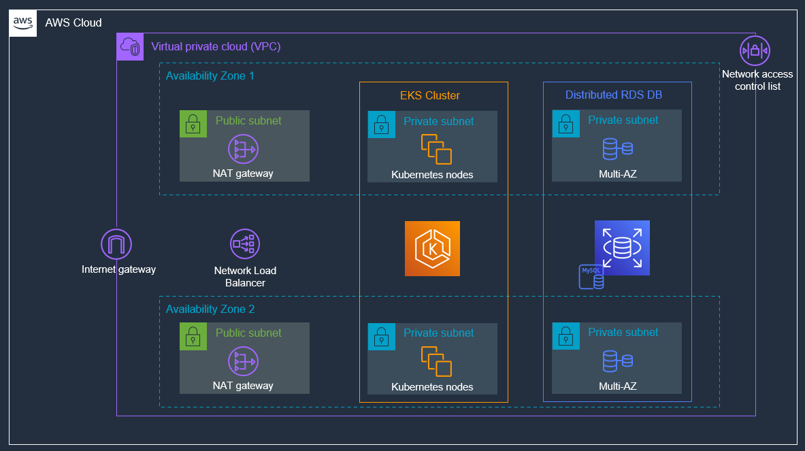
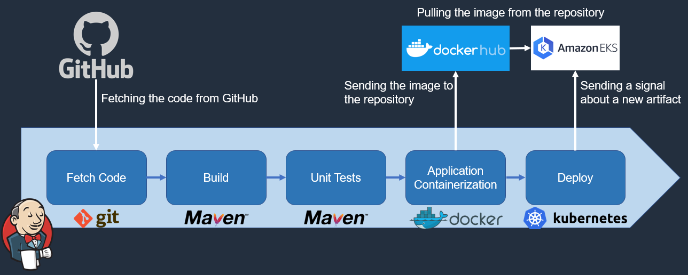

# About the Project
This project was created for the purpose of obtaining basic practical skills in DevOps. To fulfill this goal, the "Infrastructure as code" approach was used to develop the infrastructure; the CI/CD pipeline was built to automate software delivery. This project was created for deployment on the AWS cloud provider; "spring-petclinic" app was selected for deployment. It's easy and quick to deploy this project if you follow the instructions below.

# Prerequisites
+ Jenkins server with suggested (default) plugins installed.
+ Jenkins node.
+ Host with terraform, kubectl and aws cli installed.

# How it works
First, it is needed to deploy infrastructure using Terraform. Teraform creates: a separate VPC; 2 public subnets; 4 private subnets; 2 NAT gateway so that the cluster has access to the Internet; Internet Gateway; RDS; EKS cluster. A Lambda function is also created and called to initialize the database.
### Infrastructure deployed with Terraform:

Jenkins, in turn, takes the source code of the application from the repository, builds the code, executes unit tests, sends the application artifact to DockerHub, deploys a new version of the application to the EKS cluster, and finally sends a pipeline execution message to Slack.
### Jenkins pipeline:

# Configuration
## AWS
1. Create an IAM user with administrator permissions to deploy the infrastructure through terraform.
2. Create an IAM user with permissions to Read and List EKS service.
## DockerHub
Create a DockerHub repository. Specify the repository name using "DOCKERHUB_REPOSITORY" variable in the Jenkinfile later.

## Slack
1. Create a slack workspace.
2. Create a channel named "#jenkins-cicd-notifications"
3. Add [jenkins to slack.](https://my.slack.com/services/new/jenkins-ci) Take a token.
4. In "Configure System" section on jenkins server, configure Slack with the token ("Team Subdomain" in Slack corresponds to "Workspace" in Jenkins).

## Jenkins 
1. Configure a new jenkins node and connect it to the master (label it with "jenkins-node-1").
2. Install on the jenkins node:
    + OpenJDK-17
    + Docker Engine
    + AWS cli
    + kubectl
    + MySQL-server
3. Create a new user on the jenkins node, add this user to the docker group.
4. Install "Slack notification" plugin on the jenkins server.
5. In the "Global credentials" section (jenkins master), add the credentials to your Docker Hub repository (you can use a token as a password); Set the ID to "dockerhub-creds". For better security, you can [encrypt your password](https://github.com/docker/docker-credential-helpers/issues/102).
6. Add the credentials of your AWS IAM user with permissions to read and list EKS service (mentioned above). Set the ID to "aws-jenkins-access".
7. On Jenkins Master, in the "Global Tool Configuration" section, add a new JDK installation (set the JDK name to "jdk17" and the "JAVA_HOME" variable to the path where the JDK was installed). Add a new Maven installation (set the Maven name to "mvn3.8.7" and choose automatic installation from Apache, version 3.8.7).
8. ["Spring PetClinic Sample Application"](https://github.com/spring-projects/spring-petclinic) needs a connection to the database during unit testing, so you should install mysql-server and execute [sql-scripts](https://github.com/spring-projects/spring-petclinic/tree/main/src/main/resources/db/mysql) on the node where the unit testing will take place. In order for Jenkins to have access to the database, "MYSQL_SERVER" variable in Jenkinsfile is used (this variable is responsible for the address of the database).
9. Create a pipeline that meets your requirements using the Jenkinsfile in this repository.

## Terraform
In the "variable_values.auto.tfvars" located in the terraform folder, you can easily specify infrastructure and cluster configuration. Variables have self-explanatory names, but you can get more infromation about them in the "variables.tf" file. "jenkins_user_arn" variable is responsible for an arn of a user with permissions to Read and List EKS service.  

# Usage
Configure AWS, DockerHub, Slack, Jenkins according to the instructions above. Download this repository `git clone https://github.com/Neterlon/devops-simple-project-1.git`. Open the "terraform" directory to set the configurations in the "variable_values.auto.tfvars" file. 
After configuring the variable_values.auto.tfvars file, in the same directory execute `terraform init` and `terraform apply` to deploy the infrastructure. A "cluster_kubeconfig" file will be created in the same directory. In order for Jenkins to update the container images on the cluster, сopy the "cluster_kubeconfig" file to the Jenkins server using the credential type "file" and setting the credential ID to "aws-jenkins-access". After the configuration is completed, it is possible to run the Jenkins pipeline.